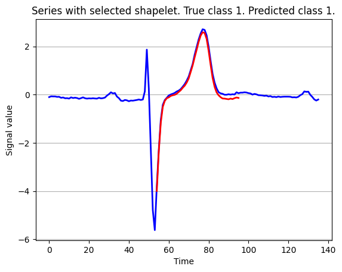
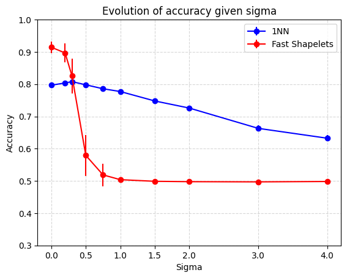

# Fast-Shapelets

MVA 2024/2025 — Mini-project for *Machine Learning for Time Series*

Authors: [Jules Chapon](mailto:jules.chapon@ensae.fr), [Corentin Pernot](mailto:corentin.pernot@ensae.fr)

## 📝 Summary

Python reimplementation of the Fast Shapelets algorithm from  
**"Fast Shapelets: A Scalable Algorithm for Discovering Time Series Shapelets"**  
(T. Rakthanmanon & E. Keogh, 2013)

Compared to brute-force shapelets and 1-NN (Euclidean, DTW) on the ECGFiveDays dataset.

## ⚙️ Features

- Fast Shapelet discovery using SAX + random masking
- Info gain-based candidate selection
- Parallelized shapelet search with `joblib`
- Support for fixed or variable shapelet lengths

## 📊 Results

- Accuracy: **99.5%** (test) with Fast Shapelets (same as original paper)
- ~10x faster than brute-force
- More accurate than 1-NN but less robust to noise

## 📌 Main Results

  

The most discriminative shapelet extracted by our implementation (in red) is shown above, overlaid on a representative time series of its predicted class (in blue). This shapelet captures a distinctive sub-pattern characteristic of one class in the ECGFiveDays dataset, and illustrates the interpretability of the Fast Shapelets method.

  

To evaluate robustness, we added Gaussian noise to the data and measured classification accuracy. As shown in the figure above, Fast Shapelets performs better than 1-NN (DTW or Euclidean) on clean data, but its performance degrades significantly as noise increases—eventually being outperformed by 1-NN in high-noise settings. This highlights a trade-off between speed/accuracy and robustness.

